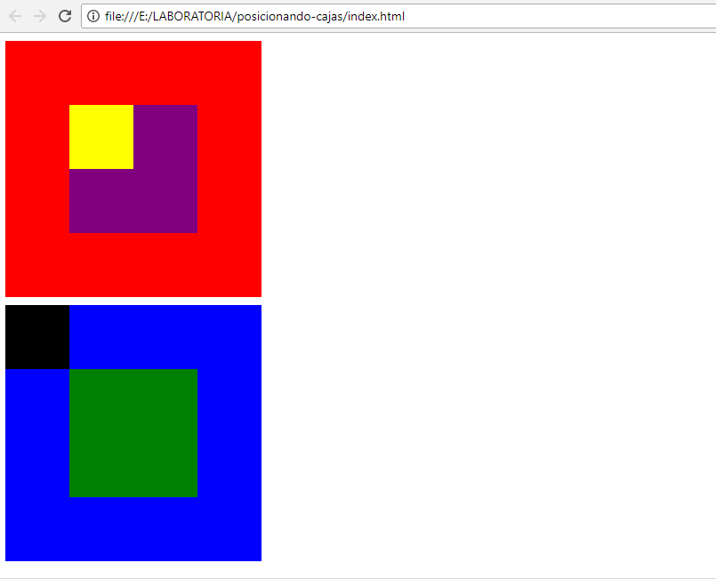

# CAJAS

## POSICIONANDO CAJAS

En este programa se hará una página que muestre dos cajas con cajas más pequeñas dentro.

### OBJETIVO 

Poner en práctica los conocimientos en positioning andf floats.

